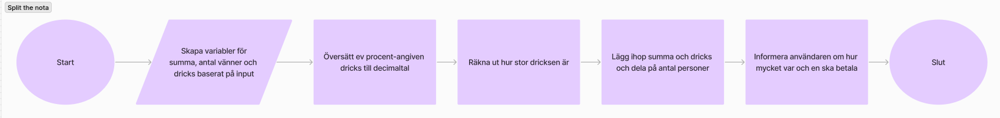
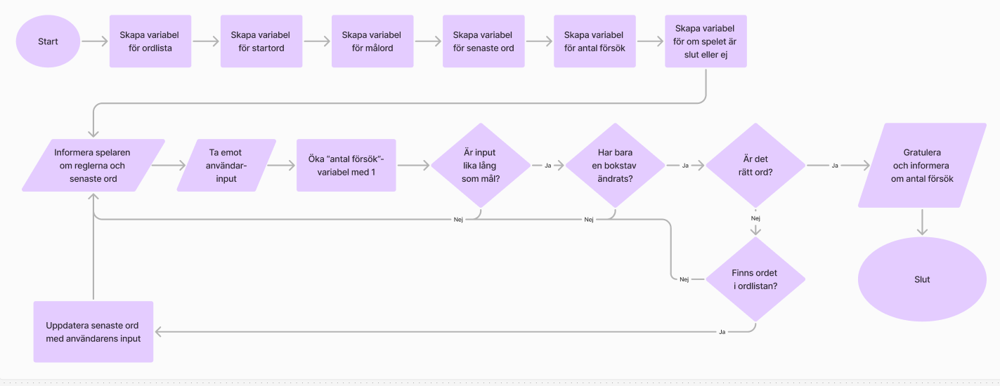

# Datalogiskt tänkande FEHT24 examination

## Uppgift i att skriva flow chart och pseudokod

Länk till uppgiften: https://github.com/fu-comp-thinking-fe24/exam-pseudo-code/tree/main

## Flow charts

**Split the nota:**

**Lewis Carrolls ordspel:**

